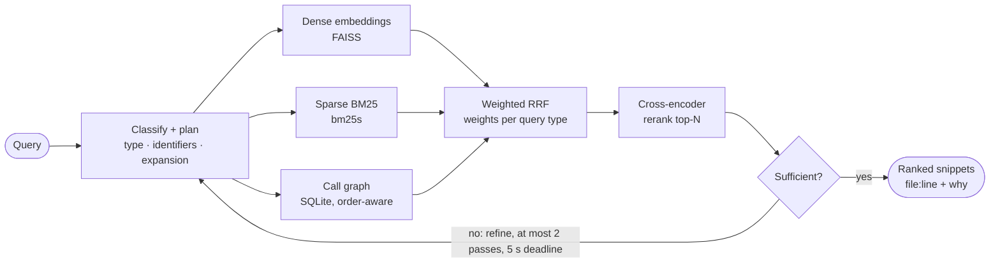

# Axiom: Agentic Code Intelligence

**Multi-pass agentic code retrieval that runs entirely on CPU.** Ask a question about a codebase in
plain English and get back a ranked list of the code snippets that answer it, each with its exact
`file:line` location. Axiom retrieves and ranks existing code; it never generates code.

Samsung PRISM GenAI Hackathon, 3rd Edition (2026-27) · **Theme 01: Agentic Code Intelligence**

| | |
|---|---|
| Team | **Incognito** |
| Institute | Thapar Institute of Engineering & Technology, Patiala |
| Members | Prabinder Singh · Anish Grover · Harshdeep Athawale · Parth Deshmukh |
| Release tag | `PRISM_GENAI_HACKATHON_Y2026` |

## Submission

| Deliverable | Link |
|---|---|
| Demo video (2:44, narrated) | **[youtu.be/QSGzV12PyO4](https://youtu.be/QSGzV12PyO4)** · file: [submission/axiom_demo.mp4](submission/axiom_demo.mp4) · script: [demo_script.md](submission/demo_script.md) |
| Live demo | Web app: [axiom-nine-delta.vercel.app](https://axiom-nine-delta.vercel.app) · API: [axiom-api-lgbt.onrender.com](https://axiom-api-lgbt.onrender.com/v1/health) (free tier: first request may take a minute to wake) |
| Presentation | [PPTX](submission/Thapar_Incognito_Submission.pptx) · [PDF](submission/Thapar_Incognito_Submission.pdf) |
| Screening result (CoIR `AppsRetrieval`) | [`appsretrieval_results.json`](appsretrieval_results.json), also attached to the release |
| AI disclosure | [AI_DISCLOSURE.md](AI_DISCLOSURE.md) |
| Dependencies | [`requirements.txt`](requirements.txt) (pip) · [`uv.lock`](uv.lock) (uv) |
| Quickstart | [below](#quickstart), five minutes from clone to ranked results |

---

## The problem

Voice-assistant codebases span thousands of JavaScript files and dozens of agents and tools. Engineers
rarely ask for new code. They ask **where something already happens**:

| | Query | Why it is hard |
|---|---|---|
| **Q1** semantic | *How is the input preprocessed before going to the main function?* | "preprocess" appears nowhere in the code. `normalize()` does. Keyword search misses it. |
| **Q2** structural | *Which files call tool XYZ before tool ABC?* | The answer is about **call order**, which is not in the text of any snippet. No embedding answers it. |
| **Q3** usage | *Where is the Bluetooth-settings deeplink used?* | An exact literal string. Semantic search dilutes it among look-alikes. |

The codebase is far larger than any LLM context window, it changes with every commit, and the system
must run on a CPU. No single retrieval technique handles all three query types, so Axiom combines three.

## How it works



1. **Classify and plan.** Each query is typed as semantic, structural, usage or hybrid. Identifiers
   are extracted (`preprocessInput`) and terms expanded (`preprocess` → `normalize`, `sanitize`).
2. **Retrieve with three signals in parallel.**
   - *Dense*: code embeddings catch meaning across vocabulary gaps.
   - *Sparse*: code-aware BM25 (camelCase and snake_case split) catches exact identifiers and strings.
   - *Structural*: a tree-sitter call, import and export graph in SQLite. Call lists keep **source
     order**, so "X before Y" is answered from the graph, with ordinal evidence.
3. **Fuse** with Reciprocal Rank Fusion, weighted by query type. A usage query leans on BM25, a
   structural one on the graph. A signal that returns nothing has its weight redistributed.
4. **Rerank** the top candidates with a cross-encoder that reads query and snippet together.
5. **Check sufficiency.** A bounded agent loop judges the scores. If they are weak it rewrites the
   query and retrieves again: at most two passes, with a hard 5 s deadline checked before each pass.

**The LLM never reads code.** An optional local LLM (Qwen2.5-1.5B, GGUF) only classifies, expands,
decomposes and judges sufficiency, and the module boundary enforces that. A heuristic rule engine is
the default, so no LLM is needed at all, and nothing is ever sent to a third-party API.

**Versions.** Chunks are content-addressed: each embedding is stored once under the hash of its
text. `axiom reindex` reads `git diff` and re-embeds only chunks whose content is new, so renamed,
moved or reverted code costs nothing. Across versions, near-identical snippets (cosine ≥ 0.95, same
symbol and file) collapse into **snippet families** with per-version diffs, instead of crowding the
results with copies.

**Degradation ladder.** Every model has a fallback: no ONNX models, no faiss, no bm25s, no
tree-sitter, and Axiom still returns ranked results and reports which rung loaded. It cannot fail on
an unfamiliar machine.

## Results

Everything below was measured on this repository; nothing is a projection or a borrowed figure.

**Screening benchmark: CoIR `AppsRetrieval`, full test split** (3,765 judged queries over 8,765
documents, no truncation). Run marked `reportable` at commit `8d22680`; artifact
[`appsretrieval_results.json`](appsretrieval_results.json).

| Arm | NDCG@10 | MRR@10 | Recall@100 |
|---|---|---|---|
| Sparse only (BM25) | 0.91 | — | — |
| Dense only | 7.59 | 6.39 | 27.22 |
| **Hybrid RRF (dense + sparse @ 0.15)** | **7.78** | **6.60** | 27.17 |

Encoder: `all-MiniLM-L6-v2` (22M parameters), the declared fallback, because the primary
`Qwen3-Embedding-0.6B` has no ONNX export yet. The reranker was not in the scored run.

**What the numbers say.** Fusion adds +0.19 NDCG@10 and nothing to recall: BM25 reorders the
candidate pool but does not enlarge it. **Recall@100 = 27.2 is the ceiling.** About three-quarters of
relevant documents never enter the pool, and reranking and refinement can only reorder what is
already there. The lever is a stronger first-stage embedder, which is the first item under
[what's next](#limitations-and-whats-next).

> APPS pairs English problem statements with **Python** solutions, so the benchmark measures dense
> and sparse retrieval only; the call-graph signal has nothing to work on there. The JavaScript,
> multi-version demo corpus is where the structural signal, P1 and the Bonus are exercised. That is
> why two config profiles exist: `configs/eval.yaml` and `configs/demo.yaml`.

**Version-aware retrieval (P1)**, on the generated 60-file, 3-version JavaScript corpus, with the
MiniLM embedder on a laptop CPU (measured 2026-09-29):

| Operation | Result |
|---|---|
| `reindex` v1.0.0 → v2.0.0, 50 files changed | **50** chunks re-embedded, 51 reused, **5.0 s** (budget 45 s) |
| `reindex` v2.0.0 → v3.0.0, content already in the store | **0** embedding calls, all 101 reused, **0.49 s** |
| Evolutionary retrieval (Bonus) | 109 snippet families over 3 versions: 101 span several versions, 44 carry real diffs |

## Quickstart

Requires Python 3.11 or 3.12 and git. CPU only.

```bash
git clone https://github.com/HarshdeepAthawale/AXIOM.git && cd AXIOM
uv venv --python 3.11 && source .venv/bin/activate     # Windows: .venv\Scripts\activate
uv sync --frozen --extra retrieval --extra structural
axiom index tests/fixtures/repo_v1 --version-id smoke --index-root /tmp/axiom-smoke
axiom query "how is user input normalized before dispatch" --version smoke --index-root /tmp/axiom-smoke --top-k 3
```

The top result is `preprocessInput` in `src/utils/normalize.js`. This first run uses the fallback
rungs, because no models are exported yet; the next section adds them.

**With pip instead of uv:**

```bash
python -m venv .venv && source .venv/bin/activate      # Windows: .venv\Scripts\activate
pip install torch --index-url https://download.pytorch.org/whl/cpu   # Linux: avoids the 2.5 GB CUDA build
pip install -r requirements.txt
pip install -e .
```

With no models downloaded, Axiom runs on its fallback rungs and prints which ones loaded.

**Real models.** Export the two small ONNX models the reported score used; this takes about three
minutes and is spelled out in [Setup.md §6.0](docs/Setup.md#60-quick-path-the-two-small-models).
`axiom index` then reports `embedder sentence-transformers/all-MiniLM-L6-v2`. Models are found from
any working directory (set `AXIOM_MODEL_DIR` to keep them elsewhere).

A CLI query loads the models in a fresh process each time, which takes a few seconds before the
search itself. For interactive use, `axiom serve` or `axiom ui` keeps them loaded: about a second per
query on a laptop CPU, with the cross-encoder scoring the top 25 candidates.

The optional local LLM (`uv sync --extra agent`, `llama-cpp-python`) needs a C compiler and is never
required.

## Try the three query types

On the bundled test repository indexed above:

```bash
axiom query "How is the input preprocessed before going to the main function?" --version smoke --index-root /tmp/axiom-smoke
axiom query "Which files call preprocessInput before resolveTool?"            --version smoke --index-root /tmp/axiom-smoke
axiom query "Where is the Bluetooth-settings deeplink used?"                   --version smoke --index-root /tmp/axiom-smoke
```

Each result card shows the file and line range, which signals found it and at what rank, and why it
ranked. This is real output for Q2 (`--snippet-lines 0`):

```
type       STRUCTURAL   passes 1 (sufficient)
results    3 of top-k 3 in 347 ms

2. src/tools/registry.js:8-15  dispatch
   signals dense #1 · sparse #1 · structural #2
   why structural: calls preprocessInput (ordinal 0) before resolveTool (ordinal 1)
```

Name both functions in a structural query. "Before `resolveTool`" triggers the ordering check;
"before dispatch" is too vague to extract as an identifier.

## Versions and evolutionary retrieval

```bash
python scripts/make_demo_repo.py /tmp/axiom_demo --files 60 --versions 3   # tagged v1.0.0 .. v3.0.0
cd /tmp/axiom_demo
axiom index . --at v1.0.0 --version-id v1.0.0 --index-root /tmp/axiom-demo-idx
axiom reindex --from v1.0.0 --to v2.0.0 --version-id v2.0.0 --index-root /tmp/axiom-demo-idx
axiom reindex --from v2.0.0 --to v3.0.0 --version-id v3.0.0 --index-root /tmp/axiom-demo-idx
axiom families --multi-only --diffs --index-root /tmp/axiom-demo-idx       # one function across versions, with diffs
axiom query "where is the deeplink parsed" --all-versions --index-root /tmp/axiom-demo-idx
axiom versions --index-root /tmp/axiom-demo-idx
```

The generator is deterministic: the same `--seed` produces a byte-identical repository, so every
number above is reproducible from the command alone.

## Interfaces

All three share one pipeline (`src/axiom/pipeline.py`), so they return identical results.

| Surface | Start it | Notes |
|---|---|---|
| CLI | `axiom --help` | `index`, `reindex`, `query`, `classify`, `versions`, `families`, `eval`, `serve`, `ui`, `gc` |
| REST API | `axiom serve --index-root <dir>` | `POST /v1/query`, `GET /v1/versions`, `GET /v1/families`, `GET /v1/chunk/{id}`, `GET /v1/health`. OpenAPI at `/docs`. Local-only by default; CORS is opt-in via `AXIOM_API_CORS_ORIGINS`. |
| Web app | `cd web && npm install && npm run dev` | The main frontend: landing page and search console on `http://127.0.0.1:3000`, with ranked results, per-signal evidence, fusion weights, stage timings, and snippet families with diffs. Needs `axiom serve` running; see [web/README.md](web/README.md). |
| Streamlit UI | `axiom ui --index-root <dir>` | A lighter Python-only UI on `http://127.0.0.1:8501`, local-only like the API. Uses a running `axiom serve` if you pass `--api-base-url`, otherwise runs in-process. |

Full contracts: [API.md](docs/API.md).

## Reproduce the evaluation

```bash
uv sync --frozen --extra retrieval --extra eval
python scripts/run_eval.py --task AppsRetrieval --split test \
    --backend scripts.eval_backends:hybrid --profile eval --out appsretrieval_results.json
```

The harness refuses to mark a run `reportable` if any placeholder constant is still live, if the
git tree is dirty, or if the loaded encoder is not the one the result claims. `--limit` gives a quick
smoke run and is always marked non-reportable. Every constant was tuned on the **train** split only;
the test split was scored once per configuration. The run log is
[`artifacts/experiments.csv`](artifacts/experiments.csv).

## Tests

```bash
uv sync --frozen --extra dev --extra retrieval --extra structural --extra serve
pytest
```

650+ tests across chunking, fusion, the structural index, the agent loop, the API, the UI, the eval
harness and the scripts. Any unmarked test slower than 1 s fails the suite, which keeps it fast.

## Repository layout

```
src/axiom/
  schema/       frozen Pydantic contract every module codes against
  chunking/     tree-sitter AST chunker, regex fallback
  indexing/     embedder ladder, dense / sparse / structural index builders, manifests
  retrieval/    the three signals and weighted RRF fusion
  rerank/       ONNX cross-encoder with a passthrough fallback
  agent/        classifier, planner, sufficiency evaluator, bounded loop, optional local LLM
  versioning/   git diff, worktrees, incremental reindex, snippet families
  eval/         MTEB adapter and metrics
  api/  ui/     FastAPI service, Streamlit app
  cli.py        Typer CLI
  pipeline.py   the one orchestrator all surfaces share
configs/        profiles: default, demo, eval, fast, accurate
scripts/        eval runner, sweeps, latency bench, demo-corpus generator
tests/          test suite and fixture repositories (repo_v1, repo_v2)
docs/           full design documentation, indexed below
web/            Next.js frontend: landing page and search console
submission/     presentation (PPTX and PDF)
```

## Limitations and what's next

| Limitation today | Next step |
|---|---|
| Recall@100 = 27.2 caps accuracy; the scored run used the 22M-parameter fallback embedder | Export `Qwen3-Embedding-0.6B` to INT8 ONNX and re-measure first-stage recall |
| Agent refinement measured as a wash: over 592 train queries, 25 helped, 26 hurt, mean ΔNDCG@10 −0.04 | Per-sub-query fan-out and LLM-written rewrites, kept only if they beat that measurement |
| No reportable score yet for the full reranked pipeline | Score it on the test split once, as for every other arm |
| Without tree-sitter, the regex chunker can attribute calls to the wrong function | Install the `structural` extra; the fallback exists so the system never stops, not for accuracy |
| JavaScript only | More tree-sitter grammars |

Every open question and its evidence is tracked in [OpenQuestions.md](docs/OpenQuestions.md), and
every correction we made to our own earlier claims is kept in [BuildLog.md](docs/BuildLog.md#6-corrections-kept-on-the-record).

## Documentation

| Start with | For |
|---|---|
| [PROJECT_OVERVIEW.md](PROJECT_OVERVIEW.md) | The whole project in one document: problem, architecture, components, results |
| [Design.md](docs/Design.md) | Architecture, principles, concurrency model, degradation ladder |
| [TechSpecifications.md](docs/TechSpecifications.md) | Per-module specs, algorithms, every tuned constant |
| [Setup.md](docs/Setup.md) | Per-platform install, model export, environment variables, troubleshooting |
| [API.md](docs/API.md) | HTTP and CLI reference |
| [BuildLog.md](docs/BuildLog.md) | Commit-by-commit engineering history, and what measuring it revealed |

<details>
<summary>All documents</summary>

| Doc | Purpose |
|---|---|
| [PRD.md](docs/PRD.md) | Requirements (`FR-##`, `NFR-##`), success metrics, jury alignment |
| [Schema.md](docs/Schema.md) | Data model, id scheme, on-disk formats, SQLite DDL |
| [Appflow.md](docs/Appflow.md) | End-to-end runtime flows with sequence diagrams and budgets |
| [_CONTRACT.md](docs/_CONTRACT.md) | The locked technical contract every other doc defers to |
| [Decisions.md](docs/Decisions.md) | `ADR-###` log: what was chosen, why, what was rejected |
| [OpenQuestions.md](docs/OpenQuestions.md) | `OQ-##` questions, with the sweeps that resolved them |
| [NonGoals.md](docs/NonGoals.md) | What is explicitly out of scope |
| [TestPlan.md](docs/TestPlan.md) | Test cases, eval protocol, performance tests |
| [Security.md](docs/Security.md) | Threat model and data handling |
| [Rules.md](docs/Rules.md) | Engineering invariants and anti-patterns |
| [Deployment.md](docs/Deployment.md) | Deployment and demo-day runbook |
| [Submission.md](docs/Submission.md) | Deck outline and demo-video script |
| [ImplementationPlan.md](docs/ImplementationPlan.md) · [Tracker.md](docs/Tracker.md) · [Changelog.md](docs/Changelog.md) | Plan, task board, releases |
| [Contributing.md](docs/Contributing.md) · [Glossary.md](docs/Glossary.md) | Dev loop, terms and metric formulas |

</details>

## Team

| Member | Owned |
|---|---|
| Prabinder Singh | Retrieval core: embeddings, BM25, fusion, MTEB wrapper |
| Anish Grover | Structural intelligence: tree-sitter chunking, call and import graph; built the implementation branch |
| Harshdeep Athawale | Agentic orchestration and reranking: classifier, agent loop, cross-encoder, demo UI |
| Parth Deshmukh | Versions and evaluation: incremental reindex, evolutionary retrieval, eval runner |

License: MIT, as declared in [`pyproject.toml`](pyproject.toml).
